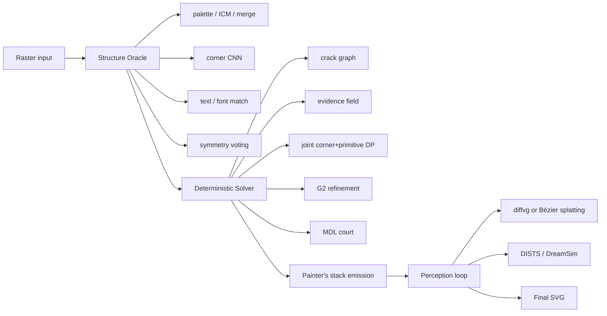
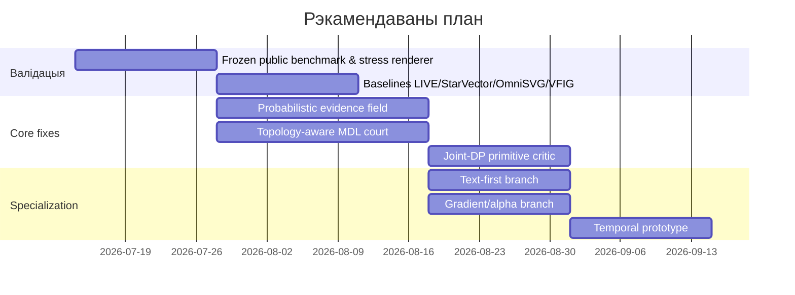
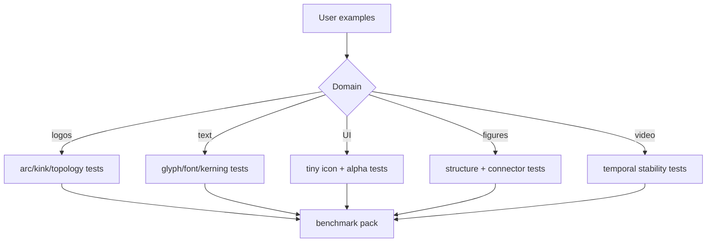

# Аналітычны аўдыт метаду ЛЁД для вектарызацыі

*Адкажу як даследчык камп’ютарнай графікі і inverse graphics, які праектаваў сістэмы raster-to-vector, differentiable rendering і SVG-пайплайны для production-інструментаў.*

## Выканаўчае рэзюмэ

Метад **ЛЁД / ICE** у пададзеным апісанні — гэта не “яшчэ адзін вектарызатар”, а вельмі амбіцыйны **гібрыдны geometry-first пайплайн**: нейрасеткі і эврыстыкі выступаюць як oracle для гіпотэз, але **канчатковую геаметрыю піша толькі дэтэрмінаваны solver**, пасля чаго ідзе абмежаваны perception loop з differentiable rasterization. Унутраная логіка метаду моцная: ёсць ясная мадэль доказнасці праз evidence tube, MDL-суд для ідэалізацыі, painter’s stack для анты-швоў, сумесны corner+primitive DP і зразумелая “драбіна деградацыі”. Гэта значна больш сур’ёзная архітэктура, чым звычайныя pure-ML або pure-tracing падыходы. fileciteturn0file0

Аднак у цяперашнім выглядзе метад **яшчэ не даказвае** ні сцвярджэнне “no artifacts”, ні сцвярджэнне “best in world”. Асноўная прычына не ў адной дэталі, а ў тым, што pipeline завязаны на шэраг моцных дапушчэнняў: лакальная двухколерная edge-spread model, карэктная інтэрпрэтацыя alpha/compositing, устойлівая сегментацыя crack-graph, правільная купля кутоў joint-DP, правільны выбар уладальніка інтэрфейсу ў painter’s stack, а таксама на тое, што ўнутраныя гейты і bank-hunting не пераўтвараюцца ў overfitting да ўласнага набора прыкладаў. У вашых жа ўнутраных нататках ужо бачныя сімптомы: засталіся праблемы з **кінкамі**, з **bank**, з **spotify_smooth_fp**, а ўнутраны набор на 50 парах дае лепшыя seam/g2/wobble, але ўсё яшчэ горшы **IoU** і горшыя **кінкі**, чым у Vectorizer.ai па адзначаных медыянах. Гэта ўжо дастаткова, каб лічыць “сусветны лідар” пакуль не пацверджаным. fileciteturn0file1

Ключавы тэхнічны рызыка — **несупадзенне мадэлі растра і мадэлі інверсіі**. Evidence field можа быць вельмі магутным, калі сапраўды існуе лакальны AA edge паміж двума амаль-канстантнымі рэгіёнамі. Але на рэальных PNG/JPEG/UI/figure-сцэнах гэта часта не так: ёсць sharpen, resample kernel mismatch, gamma-space ambiguity, multi-layer alpha, gradients, chroma subsampling, text hinting, LCD fringing, halo ад compression, partial transparency і stacked occlusions. Пакуль гэта не будзе праверана на **публічных бенчмарках** з controlled perturbations і blind hold-out, гэты кампанент трэба лічыць галоўнай крыніцай latent failure. fileciteturn0file0

Па стане літаратуры, поле за 2020–2026 выразна паказвае: **чысцютка нейрасеткавыя або code-generation-only** падыходы моцна прасунуліся ў SVG generation, але праблемы геаметрычнай дакладнасці, editability, compactness, occlusion reasoning і benchmark validity усё яшчэ адкрытыя. DeepSVG унёс іерархічную мадэль SVG і выпусціў датасэт; LIVE падкрэсліў layer-wise topology і editability; StarVector увёў SVG-Stack/SVG-Bench і наўпрост адзначыў, што MSE/піксельныя метрыкі недастатковыя; OmniSVG прапанаваў MMSVG-2M і standardized evaluation; LayerPeeler спецыяльна атакаваў occlusion; VFIG і VectorGym у 2026 ужо рухаюць ацэнку да structural integrity і VLM-as-a-Judge. Гэта значыць, што ваш агульны кірунак “geometry-first + perceptual closure + topology-aware” правільны, але доказная база павінна быць значна шырэйшай за ўнутраны 50-image subset. citeturn1academia0turn1academia1turn11academia0turn0academia0turn10academia3turn16academia2turn16academia3

Мой галоўны вердыкт: **ЛЁД выглядае як вельмі перспектыўны research-grade contender**, але цяпер ён усё яшчэ найбольш уразлівы ў пяці зонах:  
**інверсія AA/ESF, тапалогія і аклюзія, joint-DP corner economics, тэкст/шрыфты, і benchmark overfitting**. Калі мэтай з’яўляецца сапраўды “best in world”, то наступны этап павінен быць не столькі даданне яшчэ аднаго хітрага модуля, колькі **жорсткая, публічная, колькасная, reproducible валідацыя** супраць LIVE, LayerPeeler, StarVector, OmniSVG, VFIG і камерцыйных black-box baseline-аў на адкрытых датасэтах і blind human preference. fileciteturn0file1 citeturn1academia1turn10academia3turn11academia0turn0academia0turn16academia3

## Кароткае апісанне метаду

З пададзеных файлаў метад апісваецца як **трохслаёвы гібрыдны пайплайн**. Першы пласт — *Structure Oracle*: палітра, layer-graph/amodal hypotheses, corner-CNN, font matching, symmetry voting. Другі пласт — *Deterministic Solver*: crack-graph, evidence field, сумесны DP для “кут + прымітыў”, G2-refinement, tiny-template league, MDL-суд рэгулярнасцяў і staircase/fallback ladder. Трэці пласт — *Perception Loop*: differentiable rasterization і аптымізацыя толькі параметраў сямействаў прымітываў пад DISTS/DreamSim + fairness + structure-deviation. У аснове ідэалогіі — тры “законы”: evidence tube, MDL economy of idealization і painter’s stack. fileciteturn0file0

Ніжэй — сціслае раздзяленне таго, што **зададзена** ў файлах, і таго, што **не зададзена** або толькі згадана на ўзроўні намеру.

| Аспект | Што зададзена | Што не зададзена / няпоўна |
|---|---|---|
| Тып алгарытму | Гібрыдны geometry-first pipeline: oracle → deterministic solver → bounded perceptual refinement. fileciteturn0file0 | Дакладная фармальная спецыфікацыя ўсіх станаў, пераходаў і гарантый для solver не дадзена. |
| Навучальныя даныя | Ёсць згадкі пра corner-CNN, MiniNet, DeepFont/DeepFont-CNN, LayerPeeler-style oracle, але без канкрэтнага трэнінг-корпуса. fileciteturn0file0 | **Unspecified**: канчатковыя датасэты, split-стратэгіі, synthetic-vs-real баланс, negative mining, hard-case curriculum. |
| Архітэктура мадэляў | Ёсць назвы/company-level ідэі модулей, але без поўнай архітэктуры. fileciteturn0file0 | **Unspecified**: backbone, depth, tokenization, patch size, receptive field, parameter count, latency budgets. |
| Loss-функцыі | Для Stage 3 зададзены DISTS/DreamSim + fairness + structure deviation. Для joint-DP зададзена corner-buying economy. fileciteturn0file0 | **Unspecified**: loss для corner-CNN, MiniNet, glyph consensus, text detection, symmetry prior, global training objective. |
| Preprocessing | Alpha masking, palette handling, crack-graph, ESF calibration, JPEG guards, luma fallback, apron emission апісаны. fileciteturn0file0 | **Unspecified**: дакладныя color-management assumptions, ICC/linearization path, denoise/deblock strategy, resize policy, super-resolution policy. |
| Ацэнка | Унутраныя метрыкі: staircase, seam runs, wobble, curvature-step, symmetry residuals, DISTS/DreamSim, VLM-judge, human study; ёсць унутраныя гейты і 50-pair baseline vs VAI. fileciteturn0file0turn0file1 | **Unspecified**: публічны frozen leaderboard, external blind benchmark, statistical significance protocol, cross-dataset generalization criteria. |

Унутраны статус таксама важны для інтэрпрэтацыі рызык. Паводле “жывага плана” на 2026-07-13, Stages 0–2 пазначаны як выкананыя, seam=0 ужо дасягнута на ўнутраных гейтах, а медыяны супраць VAI на 50 парах палепшаныя па wobble/g2/micro, але **кінкі застаюцца горшымі**, а **IoU усё яшчэ ніжэйшы**. Гэта ўжо паказвае, што pipeline выдатна змагаецца з часткай артыфактаў, але не закрывае эквівалентна добра ні дакладнасць формы, ні corner economics. fileciteturn0file1

## Сістэматычная таксаномія магчымых памылак і артэфактаў

Найбольш карысна глядзець на памылкі не як на “спіс сімптомаў”, а як на **каскад крыніц**, дзе кожны верхні ўзровень заражае ніжні.

### Растравыя і фізічныя памылкі назірання

Галоўная рызыка тут — **неідэнтыфікаваная forward model**. Evidence field у ЛЁД інвертуе AA-coverage праз ESF з дапушчэннем пра лакальны пераход паміж двума рэгіёнамі. Гэта добра працуе толькі калі мяжа сапраўды лакальна падпарадкоўваецца гэтай мадэлі. Памылкі ўзнікаюць на антыаліясінгу з невядомым kernel, gamma mismatch паміж linear і sRGB, sharpen/ringing, JPEG 4:2:0, colored fringes, subpixel text rendering, partially transparent layers, градыентах і фактурах. У такіх сцэнах solver можа атрымаць **сістэматычна зрушаныя midpoints**, пасля чаго нават ідэальны DP пачынае “чыста” фітаваць няправільную геаметрыю. Самі файлы ўжо прызнаюць sRGB/JPEG/thin-stroke guards, але гэта толькі часткова абараняе ад класавага збою, а не ад канцэптуальнай хібнасці forward model. fileciteturn0file0

Сюды ж належаць **aliasing, staircasing, stroke wobble і subpixel jitter**. ЛЁД правільна спрабуе зрабіць staircase “канструктыўна недасягальным” праз feasible crack polyline і degradation ladder, але гэта не эквівалент “без джытару”. Poly-Bézier fallback, interval narrowing, local G2 refinement і tiny-template league могуць знішчыць лесвіцу, але ўсё яшчэ пакінуць *micro-kinks*, *tangent chatter*, *radius pumping* на паўтарах і *centroid drift* на малых і тонкіх формах. Уласныя нататкі пра 26 line-joints у spotify-case і пра мэту панізіць кiнк-медыяну да ўзроўню VAI — прамое сведчанне, што гэты клас памылак не закрыты. fileciteturn0file1

### Геаметрычныя і тапалагічныя памылкі

Тут галоўны вузел — **правільнае аднаўленне мяжы не гарантуе правільную сцэну**. Painter’s stack і single-owner interface — вельмі моцная ідэя супраць швоў, але яна адразу ўводзіць рызыку **няўдалага ownership assignment**: калі “хто зверху” або “дзе працягваецца ніжняя фігура” вызначана няправільна, вы атрымліваеце семантычна няправільны SVG без шва, але з ламанай editability, фальшывай аклюзіяй і няправільнай амадальнай формай. Гэта асабліва небяспечна для лагатыпаў, intertwined loops, stencil-like negative spaces, semi-touching glyphs і diagram connectors. Сам файл прадугледжвае speciality-cases кшталту Olympic/Audi-like rings і неабходнасць layer-graph/amodal hypotheses; гэта ўжо прыкмета таго, што праблема не лакальная, а фундаментальная. fileciteturn0file0

Другі ўзровень — **primitive misclassification**. Joint corner+primitive DP можа перакупляць або недакупляць куты, падмяняць дугу ланцугом ліній, лінію — слабой clothoid, superellipse — набору cubic’аў, а правільную ellipse — circular arc + cubic splice. У production гэта дае не толькі кiнкі, але і **topology-preserving yet semantically wrong geometry**: малюнак рэндарыцца прымальна на 1×, але дрэнна маштабуецца, рэдагуецца і друкуецца. Унутраныя заўвагі пра неабходнасць price-search для corner F1 і пра тое, што “кінкі = line-chains instead of arcs on wavy stretches” — вельмі моцны аргумент, што solver пакуль не выраўняў сваю economics з perceptual cost. fileciteturn0file1

### Памылкі рэгулярнасці, сімметрыі і тэксту

Сімметрыя і MDL-ідэалізацыя могуць як дапамагчы, так і сапсаваць вынік. Калі transform-space voting або CP-SAT будут галасаваць на няпэўных групах, з’явіцца **ложная кананізацыя**: правыя і левыя часткі стануць “роўнымі”, хаця ў арыгінале ёсць наўмысны optical overshoot, italic stress, human irregularity або asymmetry for branding. Спрабуючы перамагчы wobble, pipeline можа перакласці жывую форму ў “закругленую матэматыку”. Унутраны файл нават адзначае патрэбу ў ветах па знакавых рэзідуалах менавіта супраць такіх false regularization cases. fileciteturn0file0

Для тэксту рызыка падвойная. Калі font-snap працуе, гэта можа быць амаль ідэальна; калі не — pipeline рызыкуе выбраць **блізкі, але няправільны шрыфт** або перайсці ў faithful-outline with wrong topology. DeepFont і AdobeVFR з’яўляюцца моцным foundation для font recognition, але яны накіраваныя на распазнаванне шрыфтоў, а не на поўную graph-recovery незавершаных/растраваных glyphs у лагатыпных умовах. Для кастамных wordmarks, modified grotesks, ink traps, pseudo-geometric branding-letters font-snap можа стаць крыніцай больш грубых памылак, чым акуратны outline fitting. fileciteturn0file0 citeturn12academia1turn12academia2

### Памылкі генералізацыі, overfitting і benchmark leakage

Гэта, на мой погляд, **найбольш недаацэненая пагроза**. Другі файл вельмі адкрыта паказвае працэс bank-hunting, red-gate chasing, ручной цюнінг corner prices, promotion пасля grid search і правілы кшталту “не ручное кручэнне”. Гэта добры engineering discipline, але разам з тым гэта ўжо небяспечна блізка да **benchmark overfitting under operational pressure**. Калі pipeline пастаянна лечыць канкрэтныя чырвоныя кейсы і frozen reference set невялікі, ён можа стаць superb на ўнутраным карпусе і не вытрымаць рэальных variants: іншыя JPEG qualities, іншыя UI themes, іншыя renderers, іншыя diagram idioms, іншыя display pipelines. fileciteturn0file1

Сучасныя працы па SVG-generation якраз і рухаюцца ў бок больш шырокіх і складаных benchmark-аў. StarVector увёў **SVG-Stack** і **SVG-Bench**, адмыслова падкрэсліваючы, што піксельныя метрыкі не фіксуюць унікальныя ўласцівасці SVG. OmniSVG дадаў **MMSVG-2M** са standardized evaluation. VectorGym у 2026 прапануе expert-authored multitask benchmark, а VFIG — асобны benchmark для structural integrity complex figures. На гэтым фоне ўнутраны 50-image frozen subset трэба разглядаць як добры smoke-test, але не як доказ сусветнага першынства. citeturn11academia0turn0academia0turn16academia2turn16academia3

### Колер, alpha, градыенты і часавая нестабільнасць

ЛЁД ужо ўлічвае alpha masking, OKLab least-squares recoloring і мне падабаецца, што ў файле прама адзначана небяспека “смецця пад α=0” і праблема gradient stacks. Але тут засталася цяжкая зона: **градыентная і паўпразрыстая графіка не зводзіцца да topology + flat fills**. Нават ідэальная геаметрыя можа выглядаць дрэнна з-за фальшывага gradient stop placement, incorrect spread method, non-premultiplied estimation, clipping mismatch, banding або halo на stacking boundaries. LIVE наогул паказаў, што layer-wise compactness і editability — самастойная складаная задача; LayerPeeler яшчэ раз падкрэсліў, што без explicit occlusion reasoning vectorization дае incomplete/fragmented shapes. Гэта асабліва крытычна для плакатаў, UI-ікон, figures і branded shapes. fileciteturn0file0 citeturn1academia1turn10academia3

Калі той самы pipeline запускаць па кадрах відэа, узнікае асобны клас збояў: **temporal flicker**, z-order flips, corner birth/death, glyph snap / unsnap паміж кадрамі, primitive family switching, oscillation паміж symmetric and non-symmetric hypotheses. У пададзеным метадзе няма explicit temporal state, path identity tracking, motion-compensated regularization або cross-frame MDL. Значыць, для vectorization-from-video temporal instability трэба лічыць не бакавым, а чаканым failure mode, пакуль не ўведзены асобны temporal layer. fileciteturn0file0

Ніжэй — сціслая таксаномія ў таблічным выглядзе.

| Клас памылак | Тыповы механізм у ЛЁД | Візуальны сімптом | Найбольш інфарматыўныя метрыкі |
|---|---|---|---|
| AA/ESF model mismatch | Няправільная інверсія coverage у evidence field | boundary drift, wobble, stair-step after refinement | 95% Hausdorff, boundary F-score, signed normal error |
| Primitive selection error | Joint-DP выбірае line-chain замест arc/clothoid/ellipse | kink, corner chatter, radius pumping | curvature-step, corner event-F1, primitive confusion matrix |
| Topology/ownership error | Няправільны owner у painter’s stack, bad amodal completion | broken holes, fused components, occlusion hallucination | Euler delta, component count error, seam runs, topology edit distance |
| Symmetry/regularization overshoot | MDL/CP-SAT прымушае чужую рэгулярнасць | artificial symmetry, italic lost, branding distortion | residual-to-template, perceptual A/B, signed residual coherence |
| Text/font mismatch | Wrong font snap або broken faithful fallback | glyph substitution, spacing drift, unreadability | OCR accuracy, per-glyph IoU, kerning error, line consistency |
| Color/gradient failure | Wrong alpha, fill, stop placement, compositing | halo, banding, dirty transparency, wrong overlaps | ΔE2000/OKLab, gradient stop error, alpha RMSE |
| Domain generalization failure | Gate-tuned heuristics не вытрымліваюць новы rasterizer/data style | brittle behavior on new domains | cross-dataset drop, performance variance, failure-rate per domain |
| Temporal instability | Independent per-frame solving | flicker, topology switches, snapping oscillation | temporal LPIPS/DreamSim after optical flow warp, path-ID switch rate |

## Прыярытэтныя эксперыменты, датасэты, метрыкі і абляцыі

Для гэтага метаду я б **не пачынаў** з яшчэ аднаго модуля. Я б пачаў з эксперыментальнай матрыцы, якая separates root causes. Лепшая практыка тут — камбінацыя з **public corpora + synthetic stress rendering + blind human preference**.

Публічныя наборы, якія разумна выкарыстоўваць як базу, ужо ёсць. **Quick, Draw!** дае дзясяткі мільёнаў stroke-based дудлаў і карысны для thin-stroke/generalization/temporal-stroke reasoning; афіцыйная старонка кажа пра “50 million drawings”. **RICO** і яго вытворныя даюць публічны корпус mobile UI screenshots, у тым ліку вялікі набор іконак і дробных UI-элементаў. **DeepSVG** выпусціў вялікі SVG dataset для complex icon generation. **StarVector** прапанаваў **SVG-Stack** на 2M прыкладаў і **SVG-Bench** па 10 датасэтах. **OmniSVG** выпусціў **MMSVG-2M** са standardized protocol. **VFIG** даў **VFIG-DATA** і **VFIG-BENCH** для складаных figures. **SVGEditBench V2** і **VectorGym** карысныя не столькі як raster-to-vector GT, колькі як downstream test editability, structural fidelity і VLM-judge correlation. citeturn5view0turn4academia1turn7academia2turn1academia0turn11academia0turn0academia0turn16academia0turn16academia2turn16academia3

### Параўнанне рэкамендаваных датасэтаў

| Набор | Для чаго ён патрэбны | Што менавіта добра ловіць | Абмежаванне |
|---|---|---|---|
| Quick, Draw! | Штрыхі, малыя формы, stroke continuity | scale sensitivity, stroke jitter, primitive family errors | Дудлы занадта простыя для occlusion/gradient. citeturn5view0turn4academia1 |
| RICO / Rico-derived icon corpora | UI-іконкі, tiny elements, text+icon coexistence | малая графіка, contrast/AA issues, glyph/icon confusion | Не дае SVG GT для ўсіх экранаў; патрабуе partial or proxy GT. citeturn7academia2 |
| DeepSVG dataset | Complex icons, multi-path SVG | compactness, editability, primitive count | Менш карысны для photo-like gradients. citeturn1academia0 |
| SVG-Stack / SVG-Bench | Шырокі SVG benchmark для image-to-SVG | cross-domain generalization, code compactness, benchmark comparability | Частка задач бліжэй да code generation, чым да strict inversion. citeturn11academia0 |
| MMSVG-2M | Маштабнае multimodal SVG training/eval | model pretraining, large-scale coverage | Не заменіць жорсткі inversion benchmark. citeturn0academia0 |
| VFIG-DATA / VFIG-BENCH | Figures, diagrams, structure-heavy SVG | topology, connectors, structural integrity | Менш пра лагатыпы і UI icon tiny-text. citeturn16academia3 |
| SVGEditBench V2 / VectorGym | Editability, SVG reasoning, judge correlation | downstream edit quality, semantic correctness, VLM-as-judge | Не прама GT для strict raster inversion. citeturn16academia0turn16academia2 |

### Прыярытэты эксперыментаў

| Прыярытэт | Failure mode | Дызайн эксперыменту | Метрыкі | Ключавая абляцыя |
|---|---|---|---|---|
| P0 | Evidence-field mismatch | Рэндарыць public SVG GT у controlled pipeline: linear/sRGB, 8 kernels, blur, sharpen, JPEG Q=30/50/70/90, chroma 4:2:0/4:4:4, alpha over random backgrounds | boundary F-score, 95% Hausdorff, signed normal offset, DISTS/DreamSim | evidence OFF vs ON; space calibration OFF vs ON; luma fallback OFF vs ON |
| P0 | Kinks / line-chain pathology | Сабраць корпус arc-heavy і wave-heavy shapes з DeepSVG/SVG-Stack/VFIG; rotate 0–359°, scale 0.25×–8× | curvature-step, kink count, corner event-F1, primitive confusion | joint-DP vs split corner-then-primitive; line-first vs circle-first; with/without G2 refinement |
| P0 | Topology / occlusion | Synthetic layered SVG scenes з nested holes, touching shapes, intertwined loops, semi-occlusions; плюс VFIG figures | Euler characteristic delta, component count error, seam runs, occluder ownership accuracy | painter’s stack ON/OFF; amodal completion ON/OFF; apron width sweep |
| P0 | Text / font failures | Public font corpora + rendered wordmarks + RICO UI text/icons; blur/compression/downscale grid | OCR accuracy, per-glyph IoU @4×, line-level consistency, kerning error | font-snap vs faithful-outline vs tiny-safe |
| P1 | Symmetry overshoot | Mirror/rotational logos + deliberately asymmetric branding set | symmetry residual, human A/B, signed residual coherence | no regularization vs greedy MDL vs global CP-SAT |
| P1 | Color/gradient/alpha | SVG scenes with flat fills, transparency, linear/radial gradients, clips and masks | ΔE2000 in OKLab, alpha RMSE, stop-position error, perceptual score | recolor LSQ ON/OFF, gradient reconstruction ON/OFF |
| P1 | Overfitting / brittleness | Blind hold-out by domain and renderer; new UI pack, new poster/vector corpus, unseen export engines | generalization drop, failure rate, variance across domains | tuned thresholds frozen vs re-fit thresholds |
| P2 | Video temporal instability | Generate synthetic sequences from public SVGs with motion, scaling, occlusion changes; optionally real UI/screencast snippets | warp-consistent DreamSim, temporal boundary error, path-ID switch rate, flicker energy | per-frame only vs temporal regularizer vs path tracking |
| P2 | Stage-3 optimizer pathology | Hard cases only: bad gradients, wrong topology, close competitors | local-minima rate, runtime, perceptual gain distribution | diffvg vs Bézier Splatting; projection ON/OFF; family-only vs free control points |

### Метрыкі, якія трэба зрабіць асноўнымі

| Катэгорыя | Метрыкі | Чаму гэта важна |
|---|---|---|
| Перцэптыўныя | DISTS, DreamSim, blind 2AFC/VLM-judge | DISTS і DreamSim лепш трымаюць чалавечую перцэпцыю, чым чыста піксельныя крытэры; сучасныя SVG-бенчмаркі ўсё часцей дадаюць judge-based evaluation. citeturn9academia3turn9academia0turn16academia2turn11academia0 |
| Структурныя | IoU, boundary F-score, Chamfer, 95% Hausdorff, corner event-F1 | Гэтыя метрыкі ловяць менавіта форму і межы, а не толькі колер. |
| Тапалагічныя | Euler characteristic delta, component count, hole count error, self-intersection count | Для painter’s stack і амадальных гіпотэз гэта must-have. |
| SVG-якасць | primitive count, path count, edit operations, depth, reuse ratio | “Прыгожа на рэндэры” яшчэ не значыць “добра як SVG”. |
| Часавыя | flow-warp DreamSim, path-ID switch rate, flicker energy | Без іх нельга ацэньваць video vectorization. |
| FID-падобныя для vectors | Fréchet distance ў эмбедынгах SVG-энкодара або VLM-on-render | Дапушчальна як secondary metric, але не як галоўны acceptance gate, бо vector evaluation яшчэ нестабільная. citeturn11academia0turn16academia2 |

Аblation-design я б рабіў у двух узроўнях. Першы — **module ablations**: evidence, joint-DP, G2, font-snap, symmetry MDL, Stage 3. Другі — **stress-factorial ablations**: scale, rotation, blur, JPEG, gamma, alpha, occlusion depth, gradient complexity. Для кожнай абляцыі вынікі трэба даваць не толькі па mean/median, але і па **p90/p95 failure tails**, бо менавіта хвост вызначае, ці можна казаць “no artifacts”.

## Канкрэтныя паляпшэнні алгарытму і архітэктуры

Ніжэй — не “усё падрад”, а менавіта паляпшэнні, якія маюць найлепшае суадносіны *impact / risk* для вашага канкрэтнага pipeline.

### Параўнанне кандыдатных напрамкаў

| Напрамак | Моцныя бакі | Слабыя бакі | Мая ацэнка для ЛЁД |
|---|---|---|---|
| Geometry-first deterministic hybrid | Высокая кантраляванасць, editability, добры fit для logos/text/icons | Лёгка перарасці ў heuristic jungle | Гэта павінна заставацца цэнтрам ЛЁД. fileciteturn0file0 |
| LIVE-style layer-wise optimization | Добрая layer semantics, compact SVG | OoD/generalization і redundant paths застаюцца праблемай | Карысна як inspiration для layer-aware losses, не як замена solver. citeturn1academia1 |
| LayerPeeler-style peeling | Моца ў occlusion reasoning і complete paths | Залежнасць ад layer oracle і diffusion editing | Добра як hypothesis generator для amodal completion, не як final emitter. citeturn10academia3 |
| StarVector / OmniSVG / VLM-SVG models | Моцная семантыка, higher-order primitives, вялікія datasets/benchmarks | Precise geometry і deterministic guarantees слабейшыя | Лепш выкарыстоўваць як oracle/critic/benchmark baseline, не як sole engine. citeturn11academia0turn0academia0 |
| Differentiable refinement | Умее дашліфаваць perceptual mismatch | Лакальныя мінімумы, runtime, mush-risk | Прымяняць толькі як bounded last-mile. fileciteturn0file0 citeturn10academia0 |

### Рэкамендаваныя паляпшэнні

| Паляпшэнне | Што менавіта зрабіць | Які failure mode закрывае | Прыярытэт |
|---|---|---|---|
| Robust evidence field | Замест fixed two-color ESF уводзіць **mixture-of-forward-models**: binary edge, soft alpha edge, gradient edge, text/subpixel edge; выбар праз model evidence | boundary drift, false subpixel certainty, JPEG/gradient errors | Вельмі высокі |
| Topology-aware inference | Дадаць explicit topology score: Euler/holes/components/self-intersections у MDL-court; забараніць perceptual gain за кошт тапалогіі | false merges, broken holes, incorrect occlusion | Вельмі высокі |
| Primitive family arbitration | Навучыць асобны primitive classifier/critic на GT SVG fragments і выкарыстоўваць яго як prior для DP | line-chain kinks, wrong arc selection | Вельмі высокі |
| Uncertainty propagation | Не толькі σ для evidence, але і агульны posterior confidence на segment/shape/ownership; low-confidence zones аўтаматычна адпраўляць у conservative mode | brittle cliffs, catastrophic local errors | Высокі |
| Text-first specialized branch | OCR + font retrieval + glyph consensus + explicit “do not snap if brand-modified” detector | glyph substitutions, text jitter, kerning drift | Высокі |
| Gradient/alpha branch | Separate handling для flat vs gradient vs translucency scenes; stop optimization under compositing constraints | halo, dirty transparency, wrong blend | Высокі |
| Temporal layer | For video: path correspondence, motion-aware MDL, identity-preserving smoothing | flicker, path switches, z-order oscillation | Сярэдні, але абавязковы для video |
| Faster Stage 3 | Перайсці з DiffVG-only на Bézier Splatting або dual-backend; выкарыстоўваць refinement толькі на hard negatives | runtime, limited exploration | Сярэдні-высокі citeturn10academia0 |
| External judge loop | Add VLM-as-judge and blind human 2AFC толькі як secondary signal, не як training loss | benchmark blindness, user-facing quality mismatch | Сярэдні citeturn16academia2turn11academia0 |

Асобна падкрэслю: калі выбіраць **адно** паляпшэнне з максімальным ROI, гэта будзе **перабудова evidence field у probabilistic forward-model selector**, а не чарговы tweak у corner pricing. Куты сёння б’юць у вочы таму, што яны — бачныя, але іх лячэнне часта лечыць сімптом. Калі назіранне сістэматычна зрушана, joint-DP будзе “разумна памыляцца”.

Другое па важнасці — **тапалогія як першая-class constraint, а не пабочны вынік добрай геаметрыі**. LayerPeeler і VFIG фактычна пацвярджаюць, што occlusion/structural integrity — гэта асобны research problem, а не нешта, што выпадкова стабілізуецца добрым render loss. citeturn10academia3turn16academia3

Трэцяе — **Transformer vs CNN**. Для ЛЁД я б не ставіў гэта як “або-або”. CNN лагічны для лакальнага evidence, corners, edge confidence і text-region detection. Transformer/VLM лагічны як high-level oracle для layer graph, semantic grouping, primitive priors і complex figure decomposition; менавіта так рухаюцца StarVector, OmniSVG і VFIG. Але канчатковую геаметрыю ўсё роўна лепш трымаць у solver, інакш вы выйграеце semantic plausibility цаной дакладнасці. citeturn11academia0turn0academia0turn16academia3

## План рэалізацыі, рэсурсы, пратакол ацэнкі і крытэры поспеху

Я б разбіў workplan на тры хвалі і не мяняў іх парадак.

### Этапы і мілстоўны

**Хваля адна: доказная база.** На гэтым этапе трэба замарозіць public benchmark suite і baselines. Мінімальны набор baseline-аў: ваш бягучы ICE, Vectorizer.ai як black-box reference, LIVE, адзін code-generation baseline тыпу StarVector або OmniSVG, і адзін structure-heavy baseline тыпу LayerPeeler або VFIG. Пакуль гэтага няма, любы “палепшылі” — толькі ўнутранае адчуванне. fileciteturn0file1 citeturn1academia1turn11academia0turn0academia0turn10academia3turn16academia3

**Хваля два: core algorithmic fixes.** Тут мэта — не “яшчэ вышэйшы win-rate на тым самым сету”, а памяншэнне catastrophic tails. Канчатковыя deliverables: new evidence posterior, topology-aware MDL court, primitive arbitration prior, external ablations па scale/rotation/compression.

**Хваля тры: specialization and polish.** Асобныя text, gradient і temporal branches; Stage 3 optimization пераносіцца на Bézier Splatting-like backend або на dual renderer, бо literature на 2025 паказвае істотны speedup над DiffVG-style optimization. citeturn10academia0

### Compute і data requirements

Для **solver/ablation-heavy** этапу дастаткова аднаго моцнага research-server: 32–64 CPU cores, 256–512 GB RAM, 1–2 GPU з 24–48 GB VRAM. Для retraining corner/text oracles камфортна мець 4–8 GPU. Для VLM-style fine-tuning або вялікага multimodal oracle — ужо 8–32 high-memory GPU, але гэта не першы bottleneck. Найбольш важны рэсурс не compute, а **чысты benchmark engineering**: frozen splits, controlled renderer, failure taxonomy labels, human 2AFC, reproducible scripts.

### Пратакол ацэнкі

Пратакол павінен мець чатыры кольцы:

1. **Controlled synthetic inversion** з public SVG GT.  
2. **Real-world hold-out**: UI, logos, icons, figures, text, transparency, JPEG.  
3. **Blind human A/B** і/або validated VLM-as-judge.  
4. **Downstream SVG usability**: ручная правімасць, path compactness, semantic layer sanity. citeturn16academia2turn11academia0

### Крытэры поспеху

| Сцвярджэнне | Мінімальны доказ |
|---|---|
| “No artifacts” | Не сярэдняе, а **p95/p99**: seam runs = 0; self-intersections = 0; topology delta = 0; p95 kink count ≤ baseline; blind A/B без статыстычна значнага прайгрышу ні ў адным дамене; для video — temporal flicker і path-ID switches пад строгім парогам. |
| “Best in world” | Перамагчы адкрытыя baselines на **публічных** наборах і крытэрыях: perceptual, structural, topology, compactness, editability, human preference. У ідэале — выйграць SVG-Bench/VFIG-style suites і не прайграць на logo/text/icon subset. citeturn11academia0turn16academia3turn16academia2 |
| “Production-ready” | Runtime budget, bounded failure fallback, determinism, explainable debug traces, failure-rate на unseen domains ніжэй за зададзены SLO. |

Самая важная заўвага тут простая: **“seam runs = 0 на frozen set” не эквівалент “no artifacts”**, а “win-rate ≥50% на ўнутраным judge” не эквівалент “best in world”. Для такіх моцных сцвярджэнняў патрэбна публічная, незалежна прайгравальная база.

## Рызыкі, fallback-стратэгіі і якія прыклады патрэбныя для праверкі

### Рызыкі і fallback-стратэгіі

| Рызыка | Чаму яна сур’ёзная | Fallback |
|---|---|---|
| Evidence posterior systematic bias | Можа сапсаваць усё ніжэй па пайплайне, і solver будзе ўпэўнена няправільны | Conservative mode: broaden intervals, turn off idealization, prefer faithful poly-Bézier |
| Topology hallucination | Візуальна прымальна, але SVG семантычна сапсаваны | Topology veto before Stage 3; fallback to segmentation-preserving shape split |
| Text false snap | Чытабельнасць і брэндавая форма ламаюцца мацней, чым пры outline fit | Never-snap policy under uncertainty; faithful glyph recovery |
| MDL over-regularization | “Прыгожая” але чужая геаметрыя | Require positive proof from multiple cues before symmetry/templating |
| Benchmark overfitting | Паляпшэнні існуюць толькі на ўласным сету | Blind hold-out, hidden challenge set, freeze thresholds early |
| Stage 3 mush | Perceptual loop можа замазаць structure | Restrict to family parameters and cancel on topology/compactness regression |

Файлы ўжо прапануюць шэраг разумных conservative fallback-аў — degradation ladder, faithful outline, text-safe/tiny-safe, revert in perception loop. Гэта моцны бок метаду. Але я б узмацніў гэта правілам: **калі uncertainty высокая, pipeline заўсёды павінен выбіраць “менш прыгожа, але праўдзіва” замест “прыгожа, але прыдумана”**. fileciteturn0file0turn0file1

### Якія прыклады даслаць для жорсткага тэсту

Каб праверыць метад не “ў сярэднім”, а па сапраўды рызыкоўных класах, варта пратэставаць яго на невялікім, але вельмі зласлівым user pack. Прашу **10–20 прыкладаў** у наступных катэгорыях:

1. **Лагатыпы** з тонкімі дугамі, амаль-сімметрыямі, negative spaces.  
2. **Дробны тэкст**: 8–24 px, са compress/downscale, асабліва светлы на цёмным і наадварот.  
3. **UI-іконкі** і screenshot-crops з RICO-падобных інтэрфейсаў.  
4. **PNG з transparency** і складаныя alpha edges.  
5. **Градыентныя shapes** і паўпразрыстыя наложанні.  
6. **JPEG** з ringing/chroma artifacts.  
7. **Figures/diagrams** з arrows, connectors, nested groups.  
8. Калі цікавіць відэа — **3–10 кароткіх паслядоўнасцяў** з motion/scale/occlusion changes.

Калі падагульніць у адной фразе: **ЛЁД ужо выглядае як моцная research-сістэма з правільнай архітэктурнай інтуіцыяй, але яго weakest links цяпер не ў “яшчэ адной эврыстыцы”, а ў доказнасці назірання, тапалогіі, тэксце і строгай знешняй валідацыі**. І менавіта там праходзіць мяжа паміж “вельмі добры ўнутраны pipeline” і “сапраўды сусветны SOTA”. fileciteturn0file0turn0file1