# Як навучалі Perception-Driven Vectorization: рэканструкцыя па пэйперы, коду і мадэлях

## Кароткая выснова

Гэта не нейрасетка, якая непасрэдна ператварае PNG у SVG. Навучаная частка сістэмы - шэсць асобных `RandomForestClassifier`, па адным для намінальных памераў рэгіёна 8, 16, 32, 64, 128 і 256 px. Лес вырашае толькі лакальную бінарную задачу: ці ўспрымае чалавек канкрэтную вяршыню піксельнай мяжы як вугал. Уся астатняя вектарызацыя - выдаленне лішніх вуглоў, улік глабальнага кантэксту, падбор ліній/дуг/клатоід і рэгулярызацыя - выконваецца алгарытмічна, пераважна ў закрытых C++-бінарніках.

Асноўная схема:

```mermaid
flowchart LR
    A["Чысты квантаваны PNG"] --> B["Вылучэнне межаў рэгіёнаў"]
    B --> C["Лакальныя каардынатныя stencil-прыкметы"]
    C --> D["Random Forest для патрэбнага resolution"]
    D --> E["Мяккі score вугла; парог p > 0.125"]
    E --> F["Кароткія сегменты і глабальны closure-аналіз"]
    F --> G["Ітэратыўнае выдаленне вуглоў"]
    G --> H["Fit: line / arc / clothoid"]
    H --> I["Глабальная рэгулярызацыя"]
    I --> J["SVG"]
```



Крытычна важна: 202 PNG у [`test/`](test/) - дэма/тэставыя выявы, а не training set. Рэальныя boundaries і ручныя corner annotations знаходзяцца ў асобным каталогу [`training-data (1)`](<../training-data (1)/training-data/training/>). Ён дазваляе праверыць амаль увесь dataset sample-by-sample. Аднак для пабітавага паўтарэння навучання ўсё яшчэ не хапае training script і параметраў random hyperparameter search; акрамя таго, released annotations маюць дзве невялікія нестыкоўкі з фінальнымі `.jlib`.

## Крыніцы і ўзровень упэўненасці

Аналіз заснаваны на чатырох пластах:

1. [Пэйпер `Perception-Driven Semi-Structured Boundary Vectorization`](<../perception-driven-vectorization (1).pdf>) - склад корпуса, анатаванне, cross-validation, выбар парога і поўны постпрацэс.
2. [`training-data/README.txt`](<../training-data (1)/training-data/training/README.txt>), 157 boundary/annotation pairs, annotation GUI і [`viz.pdf`](<../training-data (1)/training-data/training/viz.pdf>) - фактычны released dataset і дакладны fold split.
3. Python-код у [`core/`](core/) - фактычная форма прыкмет, augmentation, інферэнс, выбар мадэлі і параметры C++ fitter-а.
4. Шэсць файлаў у [`assets/models/`](assets/models/) - дакладны тып estimator-а, фінальныя гіперпараметры, памеры stencil-а, класавы баланс і структура дрэў.

У тэксце ніжэй выкарыстоўваюцца наступныя пазнакі:

- **Дакладны факт** - непасрэдна ёсць у пэйперы, кодзе або `.jlib`.
- **Моцная выснова** - аднаўляецца з некалькіх незалежных артэфактаў, але training script адсутнічае.
- **Невядома** - у перададзеных матэрыялах няма дастатковых даных.

## 1. Што менавіта было навучана

Навучаны кампанент ацэньвае лакальную імавернасць вугла для кожнай вяршыні замкнёнай растравай мяжы. Ён не выбірае Bézier-крывыя, не генеруе SVG і не бачыць колер або семантыку аб'екта.

У кожным `.jlib` захаваны:

- `sklearn.ensemble.RandomForestClassifier` са scikit-learn **0.19.1**;
- stencil-памер `s`;
- канфігурацыя feature pipeline;
- класавыя пазнакі `[-1, +1]`, дзе `+1` - вугал, `-1` - не вугал;
- 320 вырашальных дрэў.

Пэйпер для прастаты запісвае labels як `{0, 1}`, але рэальная рэалізацыя навучалася і прадказвае ў прасторы `{-1, +1}`. Гэта не змяняе задачу, але тлумачыць парогі ў кодзе.

У [`core/data_processor.py`](core/data_processor.py) ёсць яшчэ два эксперыментальныя тыпы прыкмет - turn policy і closure features. Яны адзначаны як `NOT TESTED`, маюць відавочна незавершаныя ўчасткі, а ўсе шэсць рэальных мадэляў захоўваюць `feature_type = 0`. Значыць, навучаныя лясы выкарыстоўваюць **толькі адносныя каардынаты лакальнай мяжы**. Closure і іншыя глабальныя cues дадаюцца пазней алгарытмічна.

## 2. Навучальны корпус

Паводле §4.2 пэйпера, агульны training/validation corpus меў **158 semi-structured raster images**:

- 76 artist-generated распазнавальных аб'ектаў, загружаных з flaticon.com і растраваных;
- 82 сінтэтычныя геаметрычныя формы: акружнасці, эліпсы, артаганальныя палігоны і French curves.

Перададзены каталог [`training-data`](<../training-data (1)/training-data/training/>) дазваляе праверыць гэта амаль sample-by-sample. Кананічная training record - гэта пара:

- `*_boundary.txt`: ordered zero-based каардынаты ўсіх піксельных вяршынь замкнёнай мяжы;
- `*_corners.1.txt`: індэксы тых boundary vertices, якія анататар палічыў discontinuities/corners. Пусты файл - карэктная разметка «вуглоў няма».

Фактычны inventory released data:

| Resolution | Форм | Склад | Boundary vertices | Corners у `.1` | Non-corners |
|---:|---:|---|---:|---:|---:|
| 8 | 8 | толькі synthetic | 248 | 3 | 245 |
| 16 | 9 | толькі synthetic | 530 | 31 | 499 |
| 32 | 35 | 19 artist + 16 synthetic | 4 422 | 277 | 4 145 |
| 64 | 35 | 19 artist + 16 synthetic | 8 992 | 328 | 8 664 |
| 128 | 35 | 19 artist + 16 synthetic | 18 590 | 307 | 18 283 |
| 256 | 35 | 19 artist + 16 synthetic | 36 148 | 308 | 35 840 |

Такім чынам, у рэлізе **157** resolution-specific boundary/annotation pairs: 76 artist-generated records (`19 × 4`) і 81 synthetic (`16 × 4 + 8 + 9`). Колькасць artist records дакладна супадае з пэйперам, а synthetic - 81 замест заяўленых 82. У даступных матэрыялах няма надзейнага ўказання, які менавіта 158-ы прыклад адсутнічае або ці была лічба 82 у тэксце памылкай.

Для 32/64/128/256 выкарыстоўваюцца адны і тыя ж 35 shape families. Artist subset: `axe`, `fighter`, `key`, `whale`, `bow`, `dress2`, `fragile`, `lamp`, `pin`, `zeppelin`, `castle`, `dumbbell`, `guitar2`, `lipstick`, `plane`, `enterprise`, `headphone2`, `mailbox`, `ringbell`. Synthetic subset: `bridge`, `bridge45`, `circle`, `circlesmall`, `curve`, `ellipse`, `ellipse45`, `l`, `l45`, `sfont2`, `square`, `square30`, `square45`, `squaresmall`, `squaresmall45`, `tie`. Для 8 і 16 px захаваны асобныя нумараваныя synthetic shapes.

Усе 157 `.1` label files маюць валідныя індэксы без дубляў і выхадаў за boundary. Кожнае замкнёнае рабро - unit Manhattan step, то-бок classifier сапраўды бачыць чыстую 4-connected квантаваную мяжу, а не зыходныя SVG-крывыя. Большасць межаў мае аднолькавую orientation; `bridge` пры 32/64 і `bridge45` пры 64 маюць адваротную, таму orientation normalization у pipeline не факультатыўная.

PNG не з'яўляюцца непасрэдным training input для forest пасля таго, як boundary ужо вынятая. У release ёсць 169 PNG, але толькі 101 файл мае кананічнае імя `*_image.png`; частка synthetic renders захавана пад альтэрнатыўнымі імёнамі. Пры гэтым усе 157 патрэбных пар boundary + `.1` прысутнічаюць, таму classifier dataset поўны на ўзроўні прыкмет і labels.

Важна выкарыстоўваць менавіта `*_corners.1.txt`: README называе іх разметкай з пэйпера. Побач ёсць 46 unversioned `*_corners.txt`; толькі 16 з іх супадаюць з `.1`, а 30 адрозніваюцца. Гэта чарнавыя/альтэрнатыўныя annotations, і іх выпадковае змешванне істотна зменіць ground truth.

Анатаванне:

- адзін graphics graduate student;
- без ведання ўнутранай логікі праекта;
- просты GUI для ручной разметкі ўспрыманых вуглоў;
- у аглядзе методыкі пазначана каля 5-10 хвілін на адну форму;
- inter-rater agreement не вымяраўся, бо асноўную разметку рабіў адзін чалавек.

Інструкцыя ў annotation GUI патрабуе заканчваць ніжэйшы resolution **да таго, як глядзець на вышэйшы**, каб дэталёвая форма не падказвала, дзе павінен быць вугал на грубай сетцы. У `small-res/label_ui.py` прыклады з 32-512 px засталіся ад старой версіі GUI і не апісваюць фактычны каталог 8/16 px, але сама anti-bias інструкцыя адназначная.

### Асаблівая разметка кароткіх сегментаў

Калі ўспрыманы вектарны вугал ляжыць у сярэдзіне плоскага растравага рабра або двухпіксельнага сегмента, анататар пазначаў **абодва канцы** такога рабра як вуглы, а не яго сярэдзіну. Аўтары сцвярджаюць, што гэта дало лепшы classifier. Пазней corner-removal stage спецыяльна аб'ядноўвае або пераносіць такія пары.

### Released labels супраць фактычна навучаных `.jlib`

Колькасць training rows бачная ў каранёвых вузлах дрэў. Паколькі feature pipeline робіць восем сіметрычных копій кожнай вяршыні, колькасць радкоў да augmentation роўная агульнай колькасці samples, падзеленай на восем. Гэта дазваляе параўнаць release не толькі з тэкстам пэйпера, але і з фінальнымі forest artifacts.

| Resolution | Радкоў пасля augmentation | Вяршынь да augmentation | Не-вугал | Вугал | Доля вуглоў |
|---:|---:|---:|---:|---:|---:|
| 8 | 1 984 | 248 | 245 | 3 | 1.21% |
| 16 | 3 728 | 466 | 435 | 31 | 6.65% |
| 32 | 35 376 | 4 422 | 4 145 | 277 | 6.26% |
| 64 | 71 936 | 8 992 | 8 664 | 328 | 3.65% |
| 128 | 148 720 | 18 590 | 18 285 | 305 | 1.64% |
| 256 | 289 184 | 36 148 | 35 840 | 308 | 0.85% |

Для 64/128/256 лічбы класаў дакладныя, бо `bootstrap=False` і кожнае дрэва бачыць поўны набор. Для 8/16/32 `bootstrap=True`; зыходныя counts адноўлены з сярэдніх каранёвых counts 320 дрэў і патрабавання, што пасля васьмікратнага augmentation кожны клас кратны васьмі. Супадзенне з released labels на 8 і 32 px дадаткова пацвярджае гэты reconstruction.

Чатыры resolutions супадаюць цалкам: 8, 32, 64 і 256. Дзве нестыкоўкі:

- **16 px:** у release 530 vertices, а мадэль навучана на 466. Розніца дакладна роўная `small-res/16/shape8`: 64 vertices і 0 corners. Калі выключыць `shape8`, і агульная колькасць, і class counts (`435/31`) супадаюць з лесам. Значыць, гэты shape быў дададзены пазней або свядома не ўваходзіў у фінальны fit; прычына не дакументавана.
- **128 px:** агульная колькасць vertices супадае (18 590), але release мае 307 corners, а лес - 305. Супастаўленне feature vectors са статыстыкай лісця ўсіх дрэў лакалізуе ўсю розніцу ў `decent-res/headphone2/128`. Гэта сведчыць пра старэйшую разметку або reindexing перад фінальным fit. З-за сіметрычна эквівалентных feature vectors дакладна аднавіць усе два model-era labels адназначна нельга; таму нельга сумленна называць канкрэтныя два «няправільныя» індэксы ў released файле.

Такім чынам, фінальныя `.jlib` адпавядаюць **156 training records**: усім released pairs, акрамя 16 px `shape8`, і з крыху іншай 128 px разметкай `headphone2`. Гэта важна для спробаў атрымаць пабітава ідэнтычныя дрэвы.

Гэты баланс вельмі няроўны, асабліва для 8, 128 і 256 px. Пры гэтым `class_weight=None`: аўтары не кампенсавалі дысбаланс вагамі, а дабіваліся высокага recall нізкім працоўным парогам і наступным алгарытмічным выдаленнем false positives.

## 3. Як з мяжы робіцца feature vector

Няхай `p_i` - кандыдатная вяршыня замкнёнай мяжы. Яе прыкмета:

```text
f_i = [p_(i-s)-p_i, ..., p_(i-1)-p_i,
       p_(i+1)-p_i, ..., p_(i+s)-p_i]
```

Тут бяруцца `s` папярэдніх і `s` наступных вяршынь; сама `p_i` выкідваецца. Кожны пункт дае `(x, y)`, таму памер вектара роўны `4s`.

Тонкасці рэалізацыі:

- індэксы закальцаваныя праз modulo, бо мяжа замкнёная;
- усе каардынаты адносныя да `p_i`, таму feature інварыянтны да пераносу;
- маштаб не нармалізуецца, таму мадэлі прывязаныя да абсалютных пікселяў;
- boundary orientation нармалізуецца так, каб унутраная і вонкавая часткі заўсёды былі з аднаго боку ад упарадкаванай мяжы;
- гэта захоўвае адрозненне паміж concave і convex кутамі;
- калі контур карацейшы за `2s+1`, modulo пачынае паўтараць пункты. Для 8 px і `s=10` stencil можа ахопліваць фактычна ўсю форму некалькі разоў.

Захаваны pipeline ва ўсіх мадэлях аднолькавы:

| Параметр | Значэнне | Сэнс |
|---|---|---|
| `feature_type` | `0` | сырыя адносныя `(x,y)` каардынаты |
| `should_mirror` | `True` | восем сіметрычных варыянтаў |
| `should_scale` | `None` | `StandardScaler` выключаны |
| `sigma` | `-1` | Gaussian distance weighting выключаны |

Такім чынам, код змяшчае scaling і Gaussian weighting, але ніводная пастаўленая мадэль іх не выкарыстоўвае.

## 4. Augmentation і сіметрыя

Для кожнай вяршыні генеруюцца 8 пераўтварэнняў, утвораных незалежнымі аперацыямі:

- люстраванне па X;
- люстраванне па Y;
- абмен X і Y.

Іх камбінацыі адпавядаюць васьмі элементам дыяэдральнай сіметрыі квадрата - паваротам на кратныя 90° і адлюстраванням. Пры пераўтварэннях з няцотнай parity парадак суседзяў пераварочваецца, каб захаваць аднолькавую арыентацыю адносна interior.

Пэйпер прама кажа, што ўсе восем рэплік уключалі ў training data з тым самым label. Код паказвае дадатковую дэталь: **тыя самыя восем пераўтварэнняў робяцца і на inference**. Затым вынікі аб'ядноўваюцца праз `max`, а не average:

- фінальны score - максімальная corner probability з 8 варыянтаў;
- фінальны hard label - лагічнае OR: дастаткова, каб хоць адна трансфармацыя дала `+1`.

Гэта свядома recall-oriented паводзіны. Яны зніжаюць рызыку прапусціць сапраўдны вугал, але могуць павялічыць колькасць false positives; наступны corner-removal stage якраз разлічаны на іх выдаленне.

## 5. Cross-validation і выбар гіперпараметраў

Паводле пэйпера, выкарыстоўвалася 10-fold cross-validation па палігонах/формах. Для кожнага набору выпадкова выбраных гіперпараметраў classifier навучаўся на 9 групах і прадказваў дзясятую.

Шукаліся:

1. stencil size `s`;
2. `max_features` пры split-е;
3. `min_samples_split`;
4. `min_samples_leaf`;
5. split criterion;
6. bootstrap on/off;
7. колькасць дрэў.

Мэтай быў максімальны агульны `F1` па ўсіх магчымых detection thresholds у `[0,1]`. Пры cross-validation утрымлівалі толькі рэальныя object shapes; augmented geometric shapes заўсёды заставаліся ў training fold. Гэта важны нюанс: CV ацэньвае generalization на новых распазнавальных аб'ектах, але не з'яўляецца поўным hold-out усёй сумесі даных.

README да training data дае дакладны split для resolutions `>=32`:

| Fold | Test artist shapes |
|---:|---|
| 1 | `axe`, `fighter` |
| 2 | `mailbox`, `headphone2` |
| 3 | `ringbell`, `lamp` |
| 4 | `castle`, `bow` |
| 5 | `plane`, `key` |
| 6 | `pin`, `lamp` |
| 7 | `dress2`, `lipstick` |
| 8 | `dumbbell`, `enterprise` |
| 9 | `fragile`, `whale` |
| 10 | `guitar2`, `zeppelin` |

Training set кожнага fold - усе 35 models мінус гэтыя два test objects; усе 16 synthetic families таму застаюцца ў train. Ёсць дзіўная дэталь: `lamp` запісаны і ў fold 3, і ў fold 6, а кожны іншы artist object - адзін раз. У літаральным выглядзе гэта не disjoint 10-fold partition, а 10 repeated hold-outs з падвойнай вагой `lamp`; магчыма, у README простая памылка, але дадзеныя не дазваляюць вызначыць задуманы другі object.

Для 8/16 px асобнага fold layout у README няма. Дакладныя search ranges і distributions, колькасць random trials, seed hyperparameter sampler-а і training script у пакеце таксама адсутнічаюць. Таму можна вельмі блізка паўтарыць fit фінальнага estimator-а, але нельга дакладна прайграць працэс random search і выбару пераможцы.

## 6. Дакладныя параметры шасці фінальных мадэляў

Агульнае для ўсіх:

- `n_estimators = 320`;
- `random_state = 0`;
- `n_jobs = 6`;
- `max_depth = None`;
- `max_leaf_nodes = None`;
- `class_weight = None`;
- `oob_score = False`;
- `warm_start = False`;
- `min_weight_fraction_leaf = 0`;
- `min_impurity_decrease = 0`;
- `splitter = best` у базавых trees.

| Res. | `s` | Features `4s` | Criterion | Bootstrap | `max_features` | Фактычна features/split | `min_split` | `min_leaf` |
|---:|---:|---:|---|---|---:|---:|---:|---:|
| 8 | 10 | 40 | Gini | так | 0.8811676 | 35 | 2 | 3 |
| 16 | 10 | 40 | Gini | так | 0.8811676 | 35 | 2 | 3 |
| 32 | 15 | 60 | Gini | так | 0.8811676 | 52 | 2 | 3 |
| 64 | 16 | 64 | Entropy | не | 0.3480541 | 22 | 9 | 10 |
| 128 | 20 | 80 | Entropy | не | 0.3777868 | 30 | 9 | 6 |
| 256 | 30 | 120 | Entropy | не | 0.4282413 | 51 | 5 | 2 |

Структурная складанасць серыялізаваных лясоў:

| Res. | Памер `.jlib` | Усяго nodes | Сярэдне nodes/tree | Сярэдняя depth | Дыяпазон depth |
|---:|---:|---:|---:|---:|---:|
| 8 | 0.49 MB | 4 964 | 15.5 | 7.13 | 4-9 |
| 16 | 1.90 MB | 24 600 | 76.9 | 11.41 | 10-14 |
| 32 | 16.55 MB | 228 100 | 712.8 | 25.55 | 17-39 |
| 64 | 17.87 MB | 246 370 | 769.9 | 23.66 | 16-41 |
| 128 | 19.42 MB | 267 960 | 837.4 | 29.21 | 20-49 |
| 256 | 21.93 MB | 302 724 | 946.0 | 24.52 | 19-44 |

Звяртае ўвагу пералом паміж 32 і 64 px: для 8-32 выкарыстоўваюцца bootstrap, Gini і амаль усе features пры кожным split-е; для 64-256 - поўны dataset без bootstrap, Entropy і мацнейшы random feature subsampling. Нават без bootstrap дрэвы застаюцца рознымі праз выпадковы выбар падмноства прыкмет.

## 7. Што лясы фактычна лічаць важным

Я разлічыў стандартны impurity-based feature importance і склаў `(x,y)` з абодвух бакоў мяжы па адлегласці ад кандыдатнай вяршыні. Гэта не causal analysis і можа мець вядомы bias impurity importance, але добра паказвае, чым карыстаецца ўжо навучаны forest.

- **8 px:** distance 8 дае 71.94% importance, distances 7 і 9 разам яшчэ 27.42%. Амаль уся мадэль абапіраецца на далёкія/закальцаваныя пункты. Гэта адпавядае вельмі малому training support: толькі 3 positive vertices да augmentation.
- **16 px:** distance 2 дамінуе з 55.81%; distances 3-5 даюць яшчэ каля 31.2%.
- **32 px:** distance 2 - 32.41%, distance 3 - 17.58%, distance 1 - 10.99%.
- **64 px:** асноўная маса размазана паміж distances 1-5; найбольшая - distance 3 з 18.84%.
- **128 px:** distance 3 - 17.12%, distance 2 - 13.31%, distance 4 - 11.27%.
- **256 px:** distance 2 - 15.00%, distance 3 - 12.01%, distances 1 і 4 - каля 9.3-9.4% кожная.

Гэта паказвае, што для 32-256 мадэлі ў асноўным вучаць лакальную геаметрыю першых некалькіх boundary steps, але пакідаюць доўгі кантэкст. 8 px classifier хутчэй паводзіць сябе як classifier амаль усёй маленькай формы, а не чыста лакальнага кутка; яго варта лічыць найбольш крохкім.

## 8. Як probability ператвараецца ў пачатковыя вуглы

`RandomForestClassifier.predict_proba` вяртае `P(-1)` і `P(+1)`. Код пераўтварае іх у score:

```text
score = -P(-1) + P(+1) = 2 * P(+1) - 1
```

Таму score ляжыць у `[-1, +1]`. У fitter config зададзена:

```text
threshold = -0.75
cornersfrom = 'proba'
```

Гэта дакладна эквівалентна:

```text
2 * P(corner) - 1 > -0.75
P(corner) > 0.125
```

Такім чынам, `-0.75` у Python/C++ і `0.125` у пэйперы - адзін і той жа парог у розных шкалах.

Аўтары выбіралі працоўны threshold не па найлепшым F1, а так, каб на cross-validation мець не менш за **95% recall**. Ідэя - пачаць з relax-set магчымых вуглоў, у якім амаль няма false negatives, а потым алгарытмічна выдаліць false positives.

Код таксама разлічвае стандартны `forest.predict` з парогам каля 0.5, але C++ fitter чытае менавіта `proba`; hard prediction практычна толькі правяраецца на наяўнасць у `Manager`.

## 9. Што адбываецца пасля classifier-а

Навучанне - толькі initialization. Якасць выніку ў вялікай ступені забяспечвае perception-driven postprocessing.

### 9.1 Piecewise-smooth fit

Паміж суседнімі вугламі fit-аюцца прымітывы:

- line: complexity cost 1;
- circular arc: cost 2;
- clothoid: cost 4.

Энергія пэйпера: `E = alpha * D + R`, дзе `D` - L1 fitting error да midpoint-аў растравай мяжы і канцоў сегментаў, `R` - дыскрэтны кошт складанасці, а `alpha = 32 / resolution`.

Гэта дакладна бачна ў [`core/fitter_options.py`](core/fitter_options.py):

| Resolution | `ERROR_COST` |
|---:|---:|
| <=32 | 1.0 |
| 64 | 0.5 |
| 128 | 0.25 |
| 256 | 0.125 |

Fitter уключае half-space constraint і патрабуе, каб крывая праходзіла праз адпаведныя pixel-edge intervals або не далей за `epsilon = 0.1` ад іх канцоў. Пэйпер таксама апісвае tangent half-space constraints у вуглах.

Кандыдатныя лініі, дугі і клатоіды ўтвараюць граф; shortest cycle выбірае камбінацыю з найлепшым балансам error/complexity. Пасля enforce-у `C0/G1` constraints няправільныя прымітывы штрафуюцца бясконцым коштам, і shortest-path/cycle паўтараецца; паводле пэйпера, звычайна менш за 5 ітэрацый.

### 9.2 Кароткія сегменты

Сегмент лічыцца кароткім, калі ён карацейшы за 10% resolution. Ён апрацоўваецца перад асноўным greedy removal.

Ключавыя thresholds з пэйпера:

- line symmetric, калі `|phi1 - phi2| < 2°`;
- obtuse-angle rule: больш за `120°` пры павелічэнні complexity менш чым на 1;
- для length-1 дзве пазнакі замяняюцца адным mid-edge corner;
- для length-2: symmetry threshold `15°`, angle threshold `100°`, магчымае перамяшчэнне вугла ў сярэдзіну.

### 9.3 Greedy corner removal

Для кожнага corner або closure-linked corner group сістэма пералічвае vectorization без яго:

1. калі complexity `R` памяншаецца - corner кандыдат на выдаленне;
2. калі `R` не змяняецца, але fitting error `D` памяншаецца - таксама кандыдат;
3. з усіх кандыдатаў выдаляецца група з найлепшай поўнай энергіяй;
4. працэс паўтараецца, пакуль паляпшэнняў няма.

Гэта тлумачыць, чаму classifier можна наладзіць на агрэсіўны recall: канчатковыя corner labels не роўныя сырым forest predictions.

### 9.4 Closure/global context

Глабальны аналіз парыць concave corners двума спосабамі:

- агульная ўнутраная акружнасць, блізкая да medial axis; для inside-test яе маштабуюць на 0.90;
- унутрана бачныя пары, чые сумежныя spline tangents працягваюцца з розніцай менш за 5°.

Пары выдаляюцца або захоўваюцца разам. Гэты механізм не ўваходзіць у Random Forest features.

### 9.5 Рэгулярызацыя

Пасля corner removal сістэма greedily шукае:

- амаль axis-aligned лініі, не далей за 10° ад восі;
- co-circular arcs;
- co-linear і parallel lines;
- orthogonal або амаль аднолькавыя corner tangents;
- пары tangents у межах 20°, якія можна зрабіць бесперапыннымі.

Пры regularization accuracy tolerance relax-іцца з 0.1 да 0.2. У пастаўленым fitter config уключаны `REGULARIZE`, `SIMPLIFY`, `GLOBAL_ANALYSIS`, `SHORT_SEGMENTS` і `HALFSPACE_CONSTRAINT`.

## 10. Як выбіраецца мадэль патрэбнага resolution

Resolution - не абавязкова памер PNG canvas. Гэта найбольшы бок bounding box рэгіёна, прыведзены да resolution bucket.

### Single-region black-and-white path

[`Polygon.get_reso`](core/polygon.py) акругляе `log2(max_bbox_dimension)` да найбліжэйшага цэлага, вяртае `2^k`, а потым clamp-іць вынік у `[32, 256]`.

Наступствы:

- 8.jlib і 16.jlib **ніколі не выкарыстоўваюцца** single-region GUI path;
- усе вельмі маленькія single-region формы ідуць у 32.jlib;
- 256.jlib даступны тут.

### Multi-color path

[`core/manager.py`](core/manager.py) выкарыстоўвае іншыя, арыфметычныя межы:

| Max bbox span | Мадэль |
|---:|---:|
| `< 10` | 8 |
| `10 .. <24` | 16 |
| `24 .. <48` | 32 |
| `48 .. <96` | 64 |
| `96 .. <192` | 128 |
| `>=192` | 128 |

Тут 256.jlib **ніколі не выкарыстоўваецца**: вялікія каляровыя рэгіёны таксама атрымліваюць 128.jlib. Гэта ўжо разыходжанне паміж агульным апісаннем пэйпера («closest power of two») і канкрэтным evaluation GUI.

## 11. Multi-color pipeline

Для каляровых PNG:

1. вакол выявы дадаецца 1-pixel border колеру верхняга левага пікселя;
2. `pixel_graph.exe` будуе topology/adjacency graph;
3. Python-код вылучае асобныя boundaries і іх колеры;
4. кожная мяжа незалежна атрымлівае corner probabilities;
5. shared boundary vertex прызнаецца corner толькі калі абодва сумежныя рэгіёны лічаць яго corner - гэта свядомы bias у бок continuity;
6. `cornu_cli_multi.exe` сумесна fit-іць boundaries і стыкуе multi-region vertices;
7. ствараюцца black і experimental color SVG.

Гэтая частка не навучаецца на RGB. Колер патрэбны для segmentation і fill; forest па-ранейшаму бачыць толькі геаметрыю кожнай мяжы.

## 12. Што ляжыць у `test/`

Фактычны інвентар:

- 202 PNG;
- 156 black-and-white: 39 сюжэтаў × 4 resolution-варыянты;
- 46 color: 18 сюжэтаў з 2-4 варыянтамі;
- фарматы: 105 RGBA, 58 palette (`P`), 35 grayscale (`L`), 4 RGB;
- black-and-white выявы звычайна маюць 2 квантаваныя колеры; максімум 9 у некалькіх файлах;
- color выявы маюць 2-7 квантаваных колераў;
- 7 каляровых файлаў маюць binary transparency 0/255.

Многія black-and-white файлы з назвай `32_image.png` фізічна маюць 42×42, `64` - 74×74, `128` - 138×138, `256` - 266×266. Гэта пераважна padding; classifier выбіраецца па object boundary bbox, таму canvas dimensions і лічба ў filename не з'яўляюцца непасрэдным model input.

У `test/` няма 8/16-series і няма corner annotation files. Таму гэта не той поўны набор, на якім былі fit-нуты `.jlib`.

Сем файлаў з transparency:

- `test/color/cloud/cloud_32x32.png`;
- `test/color/cloud/cloud_64x64.png`;
- `test/color/crown/crown_64x64.png`;
- `test/color/shirt/tshirt_32x32.png`;
- `test/color/turtle/swimming-turtle_64x64.png`;
- `test/color/user/profile_32x32.png`;
- `test/color/user/profile_64x64.png`.

Код замяняе толькі цалкам празрыстыя пікселі белымі. Partial alpha не мадэлюецца. Гэта ўзгадняецца з папярэджаннем у [`INSTRUCTIONS.txt`](INSTRUCTIONS.txt), што transparency не рэкамендуецца.

## 13. Валідацыя, якую паведамляе пэйпер

Для Random Forest corner detector-а супраць ручной разметкі:

| Resolution | Precision | Recall | F1 |
|---:|---:|---:|---:|
| 32 | 0.835 | 0.910 | 0.871 |
| 64 | 0.907 | 0.850 | 0.877 |
| 128 | 0.923 | 0.880 | 0.901 |

Двухслаёвы MLP, навучаны ў той самай пастаноўцы, атрымаў крыху горшыя F1: 0.819, 0.848 і 0.885 адпаведна. Таму выбар Random Forest быў эмпірычным, а не толькі інжынерным.

Пэйпер таксама паведамляе, што classifier inference для ўсіх boundary vertices займаў каля 0.2-0.3 s, а асноўны час ішоў на corner removal і fitting. Full method у user study перамагала Vector Magic прыкладна ў 5.58 раза па перавагах карыстальнікаў і Potrace - у 6.89 раза. Гэта ацэньвае поўны pipeline, а не forest асобна.

## 14. Асноўныя рызыкі, biases і тонкасці

### Single-annotator bias

Classifier вучыцца на ўспрыманні аднаго анататара. Пэйпер правярае канчатковыя vectorizations на шырэйшым user study, але не паказвае міжанататарскую згоду для corner ground truth.

### Моцны class imbalance без ваг

Positive class вагаецца ад 0.85% да 6.65%, `class_weight=None`. Нізкі threshold 0.125 і max-over-augmentations - неабходная частка дызайну, а не выпадковая настройка.

### Synthetic data заўсёды ў train folds

Geometric shapes не ўтрымліваліся ў CV. Таму cross-validation не вымярае generalization на цалкам новыя геаметрычныя priors.

### CV split не зусім disjoint

У released README `lamp` уваходзіць адразу ў folds 3 і 6. Калі гэта не typo, reported aggregate F1 двойчы ўлічвае гэты object і split тэхнічна з'яўляецца repeated hold-out, а не строгім 10-fold CV.

### Dataset/model version drift

Released data не з'яўляецца дакладным snapshot-ам фінальнага fit: 16 px `shape8` адсутнічае ў мадэлі, а 128 px `headphone2` мае іншую разметку. Акрамя таго, unversioned `corners.txt` часта адрозніваюцца ад афіцыйных `.corners.1.txt`. Без фіксацыі manifest-а вельмі лёгка навучыць «амаль тую ж» мадэль на іншым ground truth.

### Абсалютны піксельны маштаб

Няма scaling, а `s` розны па resolutions. Таму classifier не scale-invariant. Пэйпер адзначае, што 32px classifier на больш высокіх resolutions працуе амаль нармальна, але high-res classifier на coarse input дае false negatives.

### 8px classifier вельмі крохкі

Да augmentation у ім усяго 248 samples і толькі 3 positives. Ён амаль цалкам залежыць ад далёкіх, закальцаваных stencil positions. Яго вынікі павінны моцна залежаць ад складу невялікага synthetic set.

### Max aggregation на inference

Нават калі training augmentation добра навучыў сіметрыю, код яшчэ раз правярае ўсе 8 варыянтаў і бярэ maximum. Гэта робіць рэальны operating point больш агрэсіўным за простае прадказанне адной canonical orientation.

### Чыстыя квантаваныя boundaries

Метад разлічаны на hard-color regions. Anti-aliasing, шум, gradients і partial alpha парушаюць boundary extraction і accuracy constraints. Пэйпер паказвае гэтыя failure cases асобна.

### Семантыка не выкарыстоўваецца

Forest не ведае, што перад ім вуха, дзюба або кола машыны. Аўтары самі адзначаюць failure cases, дзе чалавек выкарыстоўвае распазнаванне аб'екта, а геаметрычны pipeline - не.

### C++-частка не аўдытуецца з Python-коду

`regularize_16_04_2018.exe`, `cornu_cli_multi.exe` і `pixel_graph.exe` пастаўлены толькі як бінарнікі. Пэйпер і option files добра апісваюць прызначэнне, але немагчыма праверыць, што кожная ўнутраная дэталь бінарніка цалкам супадае з псеўдакодам.

## 15. Reproducibility і сумяшчальнасць

Пакет разлічаны на:

- Python 3.6;
- scikit-learn 0.19.1;
- PyQt4 / Qt4Agg;
- legacy `sklearn.externals.joblib`;
- Windows 7/10 x64.

Мадэлі запісаны pickle protocol 2 без compression. Яны не загружаюцца напрамую ў сучасным scikit-learn праз перанесеныя module paths і несумяшчальны binary layout старых `Tree` objects. Акрамя таго, pickle/joblib нельга лічыць бяспечным фарматам для недавераных файлаў.

Для дакладнага паўтарэння навучання не хапае:

- training script і manifest-а, які задаваў selection і парадак samples;
- random-search ranges/distributions, колькасці trials і seed sampler-а;
- fold layout для 8/16 px і тлумачэння дубля `lamp` у folds 3/6 для `>=32`;
- model-era 16 px selection і 128 px `headphone2` labels, бо released snapshot крыху адрозніваецца ад фінальных `.jlib`;
- дакладнай версіі preprocessing runner-а, якім boundaries ператвараліся ў матрыцы прыкмет;
- зыходнікаў C++ fitter-а ў гэтым evaluation package.

## 16. Як найбольш блізка паўтарыць навучанне

1. Узяць `*_boundary.txt` і менавіта `*_corners.1.txt` з released training data. Для найбліжэйшага match да `.jlib` выключыць 16 px `shape8`; дакладны 128 px model-era ground truth без аўтарскага файла аднавіць нельга.
2. Для кожнага resolution асобна загрузіць ordered pixel-boundary vertices і перавесці labels у `-1/+1`; для edge-centered і two-pixel corners ground truth ужо змяшчае абодва канцы.
3. Нармалізаваць orientation адносна interior, асабліва для трох released boundaries з адваротным кірункам.
4. Для кожнай вяршыні пабудаваць raw relative-coordinate vector памеру `4s`.
5. Зрабіць усе 8 D4 augmentations з карэкцыяй парадку boundary points.
6. Не выкарыстоўваць StandardScaler, Gaussian weighting або class weights.
7. Fit-нуць асобны 320-tree Random Forest для кожнага resolution з параметрамі з табліцы вышэй і `random_state=0`, пажадана ў scikit-learn 0.19.1. Парадак samples павінен быць фіксаваны, бо ён уплывае на bootstrap-мадэлі.
8. Калі мэта - паўтарыць model selection, для `>=32` выкарыстоўваць released fold table, але асобна вырашыць неадназначнасць `lamp`; усе synthetic shapes пакідаць у train. Без search distributions гэта ўсё роўна будзе reconstruction, не ідэнтычны experiment.
9. На inference паўтарыць 8 transforms і ўзяць maximum probability.
10. Пераўтварыць probability ў score `2p-1` або непасрэдна выкарыстоўваць `p>0.125`.
11. Абавязкова рэалізаваць postprocessing: short segments, closure groups, greedy corner removal, constrained line/arc/clothoid fitting і regularization. Без гэтага атрымаецца толькі «pure classifier» baseline з пэйпера, а не іх фінальны метад.

## 17. Праверачныя hashes артэфактаў

Мадэлі:

| Файл | SHA-256 |
|---|---|
| `8.jlib` | `FBF87DCA1C6BED243A3143D0BE8C3188FA724D1C38BA25E6CA7376511D721D6A` |
| `16.jlib` | `B3112604D88E09F364874EE690BE331524654DFCDD7C22D43F9F7EC8E67D4C6B` |
| `32.jlib` | `087235DB2F410C408A31BFC95155DBC7A729E5789CE59C2B424A5B2281E1E3A3` |
| `64.jlib` | `C4DBF75740B12A274D84B863A83618EA420511547BAE23004E744179911553B8` |
| `128.jlib` | `0EB51E231DEA1475E185C50043DA752CD69B12F158EAD4A55D389184C619B3E0` |
| `256.jlib` | `DE98D29699B67DE19361FD61BF723F290C8864ECA36ECC7B72157CBBE65E9BE6` |

C++-бінарнікі:

| Файл | SHA-256 |
|---|---|
| `regularize_16_04_2018.exe` | `7A47B5EAA706026DD054B3E309C2B41CE6C596411C73FC9DBFF92674CC271F53` |
| `cornu_cli_multi.exe` | `9BBFC6036D3432B69AD3747209ADDE38BAC235F1DC08F49EBD0F6BE2AFCB8889` |
| `pixel_graph.exe` | `B75F33A5A7ECBEEB73275E7395A7751ED267FD6D58350FFE8BDED58BB7BF16D5` |

## Фінальны вердыкт

Сіла метаду не ў «вялікай навучанай мадэлі», а ў правільным падзеле працы. Невялікі resolution-specific Random Forest дае recall-oriented лакальныя hypotheses пра вуглы. Затым жорстка спраектаваны perception-driven optimizer улічвае accuracy, simplicity, continuity і closure, выдаляе лішнія hypotheses і рэгулярызуе геаметрыю. Менавіта гэтая гібрыдная схема дазволіла працаваць на вельмі малым корпусе: пэйпер заяўляе 158 анатаваных records, released data змяшчае 157, а sample counts фінальных `.jlib` адпавядаюць 156 records з адной невялікай 128 px label revision.
